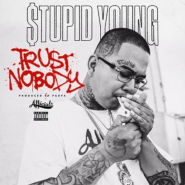

  

I like hip-hop, cooking, basketball, diagnosing Japanese vehicles, archaeology, driving, writing, downloading music, old paintings, martial arts, eating, classic eastern texts, games, adult swim, plants, National Geographic, VICE, the piano, Texas Hold'em, meeting nice people, the Olympics, and chemistry. How I ultimately ended up on here is beyond me
***

- ~~BSSE UGRD :watermelon:~~
- Told ya :tooth:
- Usually here for casual, smaller projects :seedling:
- If I'm not here, I'm probably actually not sitting in front of a PC screen :sunflower:
- Oolong tea the greatest tea 

## Workspace 

| Languages                                                  | Tools | Other |
|    :----:                                                  |    :----:   |    :----:   |
|              |        |   |

## Most Recently Played: 

|  Heartless - Single  |  Trust Nobody - Single  |  Loud Pack  |
|:-:|:-:|:-:|
| [**Yungn True**](https://music.apple.com/us/artist/yungn-true/1355954684) HIP-HOP/RAP · 2022 | [**$tupid Young**](https://music.apple.com/us/artist/%24tupid-young/444628011) HIP-HOP/RAP · 2018 | [**Yung Jae**](https://music.apple.com/us/artist/yung-jae/838648363) HIP-HOP/RAP · 2016 |
| 1 [Heartless](https://music.apple.com/us/song/heartless/1644019720)  | 1 [Trust Nobody](https://music.apple.com/us/song/trust-nobody/1435403867)  | 7 [Can't Deny (feat. Heartbreaka & Tee Cambo)](https://music.apple.com/us/song/cant-deny-feat-heartbreaka-tee-cambo/1188974190)  |

|  Federal 3X  |  Tee Cambo: The Untitled Project  | ") Year of the Gentleman (Deluxe Edition) |
|:-:|:-:|:-:|
| [**Moneybagg Yo**](https://music.apple.com/us/artist/moneybagg-yo/991187319) HIP-HOP/RAP · 2017 | [**Cambo Movement**](https://music.apple.com/us/artist/cambo-movement/1128877975) HIP-HOP/RAP · 2016 | [**Ne-Yo**](https://music.apple.com/us/artist/ne-yo/78257321) R&B/SOUL · 2008 |
| 4 [Doin’ It](https://music.apple.com/us/song/doin-it/1440901034)  | 1 [Do That](https://music.apple.com/us/song/do-that/1130526304)  | 5 [Miss Independent](https://music.apple.com/us/song/miss-independent/1445834188) |

## Metrikz 

 

  

## Book List 
|  |  |  |
|:---:|:---:|:---:|
| **Overyear** | **Chinese Cinderella** | **Tomorrow I'm Dead** |
| Dr. G | Adeline Yen Mah | Bun Yom |

## Connections 

