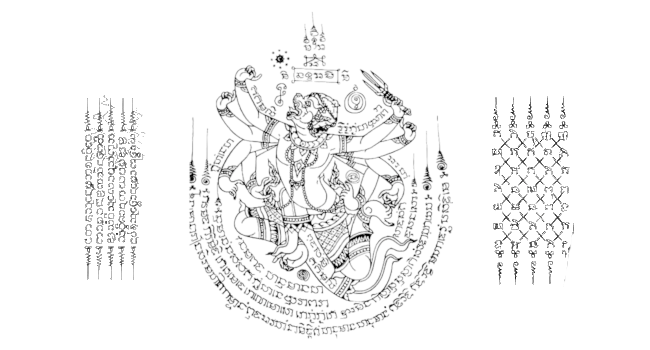

  

I like hip-hop, cooking, basketball, diagnosing Japanese vehicles, archaeology, driving, writing, downloading music, old paintings, martial arts, eating, classic eastern texts, games, adult swim, plants, National Geographic, VICE, the piano, Texas Hold'em, meeting nice people, the Olympics, and chemistry. How I ultimately ended up on here is beyond me
***

- ~~BSSE UGRD :watermelon:~~
- Told ya :tooth:
- Usually here for casual, smaller projects :seedling:
- If I'm not here, I'm probably actually not sitting in front of a PC screen :sunflower:
- Oolong tea the greatest tea 

## Workspace 

| Languages                                                  | Tools | Other |
|    :----:                                                  |    :----:   |    :----:   |
|              |        |   |

## Most Recently Played: 

<table>
<tr>
<td>  
</td>
<td>

<b>Trust Nobody - Single </b>

<a href="https://music.apple.com/us/artist/%24tupid-young/444628011">$tupid Young</a>

HIP-HOP/RAP · 2018

 

1  
<a href="https://music.apple.com/us/album/trust-nobody/1435403864?i=1435403867">
Trust Nobody
</a>

</td>
</tr>
</table>

<table>
<tr>
<td>  
</td>
<td>

<b>Tee Cambo: The Untitled Project </b>

<a href="https://music.apple.com/us/artist/cambo-movement/1128877975">Cambo Movement</a>

HIP-HOP/RAP · 2016

 

1  
<a href="https://music.apple.com/us/album/do-that/1130525706?i=1130526304">
Do That
</a>

</td>
</tr>
</table>

<table>
<tr>
<td>  
</td>
<td>

<b>Someone - Single </b>

<a href="https://music.apple.com/us/artist/marvin-dolo/1179170802">Marvin Dolo</a>

R&B/SOUL · 2018

 

1  
<a href="https://music.apple.com/us/album/someone/1446305751?i=1446305762">
Someone
</a>

</td>
</tr>
</table>

## Metrikz 

 

  

## Book List 
|  |  |  |
|:---:|:---:|:---:|
| **Overyear** | **Chinese Cinderella** | **Tomorrow I'm Dead** |
| Dr. G | Adeline Yen Mah | Bun Yom |

## Connections 

