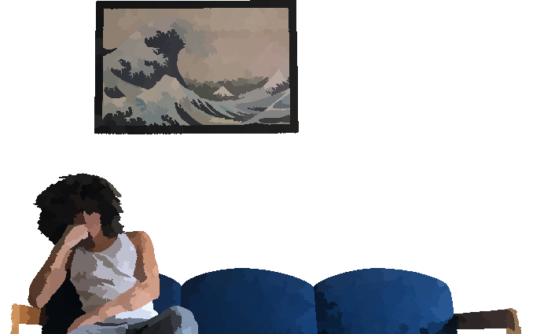

<h1 align="center">Ayyy, it's Royal -‿v </h1>

 

<h2>random stuff </h2>

#### from over the years 
 🖰 check out Philly
 🖰 here and there, either busy doin' work, tryin' stuff out, or just m0nkeying
 🖰 don't make inexorable conclusions
 🖰 don't waste time [at least, for the most part (try not to)] :kissing_closed_eyes:
 🖰 don't try to barbecue bacon
 🖰 genuinity
 🖰 oouuu, coding sure's somethin'

  as one who lives to eat, here're some things I like to indulge on :trollface:
  croissants 
  oolong tea 
  spicy stuff 
  boba tea 
  cephalopods 
  cheese 
  chocolate 
 
 

<h2>statistics </h2>
 

 
 

<b>Stay Steady</b> ✌︎

🎋

 
 

